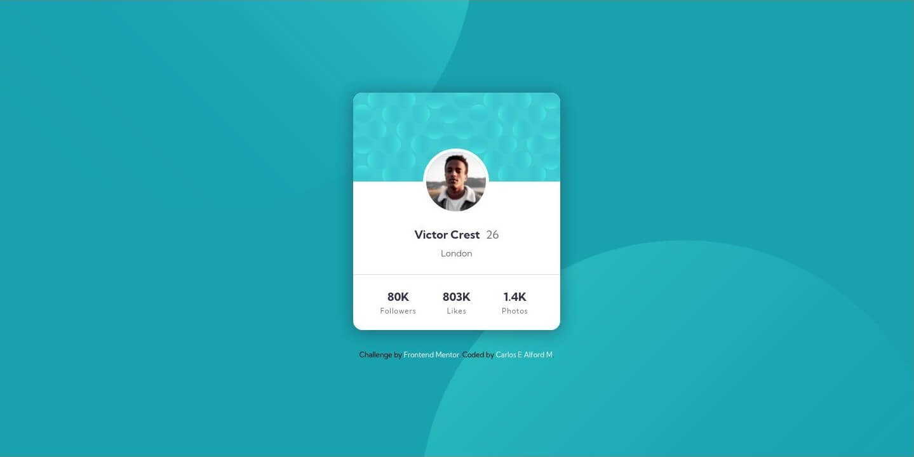

# Frontend Mentor - My Solution

:computer: Here are my solutions to the frontend challenges created by frontend mentor.

## Table of contents

- [Overview](#overview)
  - [My vision](#my-vision)
  - [Repo purpose](#repo-purpose)
- [Solutions](#solutions)
  - [Newbie](#newbie)
  - [Junior](#junior)
  - [Intermediate](#intermediate)
  - [Advanced](#advanced)

## Overview

### My vision :eyes:

To join the world of web development professionally and share my passion of
all things web. This way I can help create amazing things which can be enjoyed
by other people, whether to help them achieve a goal or just have fun.

### Repo purpose :smiley:

The purpose of this repo is to use these challenges as practice and improve or
gain knowledge about web development. Maybe in the mean time also help other
developers tackling the same challenges and are stuck.

## Solutions

Each solution is separated by the difficulty level and a screenshot of the
final piece.

### Newbie

### Junior

_coming soon ..._

### Intermediate

_coming soon ..._

### Advanced

_coming soon ..._

## Author

- Website - [Carlos E Alford M](https://carlosealford.com)
- Twitter - [@webshuriken](https://www.twitter.com/webshuriken)
- Frontend Mentor - [CarlosEAM](https://www.frontendmentor.io/profile/CarlosEAM)
