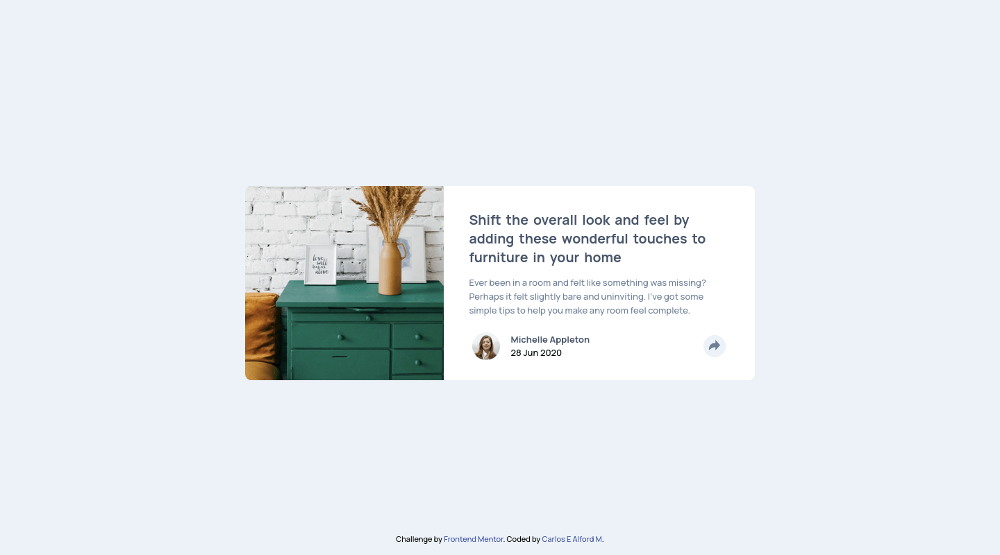

# Frontend Mentor - Article preview component


## Welcome! 👋

Thanks for checking out this front-end coding challenge.

[Frontend Mentor](https://www.frontendmentor.io) challenges help you improve your coding skills by building realistic projects.

**To do this challenge, you need a basic understanding of HTML, CSS and a tiny bit of JavaScript.**

## The challenge


# Frontend Mentor - Four card feature section solution

This is a solution to the [Four card feature section challenge on Frontend Mentor](https://www.frontendmentor.io/challenges/four-card-feature-section-weK1eFYK). Frontend Mentor challenges help you improve your coding skills by building realistic projects.

## Table of contents

- [Overview](#overview)
  - [The challenge](#the-challenge)
  - [Screenshot](#screenshot)
  - [Links](#links)
- [My process](#my-process)
  - [Built with](#built-with)
  - [What I learned](#what-i-learned)
  - [Continued development](#continued-development)
- [Author](#author)
- [Acknowledgments](#acknowledgments)

## Overview

### The challenge

Your challenge is to build out this article preview component and get it looking as close to the design as possible.

You can use any tools you like to help you complete the challenge. So if you've got something you'd like to practice, feel free to give it a go.

The only JavaScript you'll need for this challenge is to initiate the share options when someone clicks the share icon.

Your users should be able to: 

- View the optimal layout for the component depending on their device's screen size
- See the social media share links when they click the share icon

### Screenshot



### Links

Here are the links to my solution on GitHub and the live page where you can check out the profile card on your browser.

- Solution URL: [Github Repo](https://github.com/web-shuriken/frontend-mentor-my-solutions/tree/main/article-preview-component)
- Live URL: [Four Card Feature](https://web-shuriken.github.io/frontend-mentor-my-solutions/article-preview-component/)

## My process :computer:

### Built with

- Semantic HTML5 markup
- CSS custom properties
- CSS Grid
- Mobile-first workflow
- SASS
- Git and Github

### What I learned

Using Grid to offset the location of boxes, creating a
brick bond style.

```sass
.fcf__body
  grid-template-columns: repeat(4, 1fr)
  grid-template-rows: repeat(3, 1fr)
  column-gap: 1.4rem

.fcf__card-supervisor
  grid-column: 1 / 3
  grid-row: 2 / 3
  justify-self: end
```

### Continued development

Even though it is stronger than when the challenge begun I could always do with more practice using Grids.

## Author

- Website - [Carlos E Alford M](https://carlosealford.com)
- Frontend Mentor - [CarlosEAM](https://www.frontendmentor.io/profile/WebShuriken)
- Twitter - [@webshuriken](https://www.twitter.com/webshuriken)

## Acknowledgments

To the whole Dev Community, keep dreaming and innovating. Thank you all. :smile:
