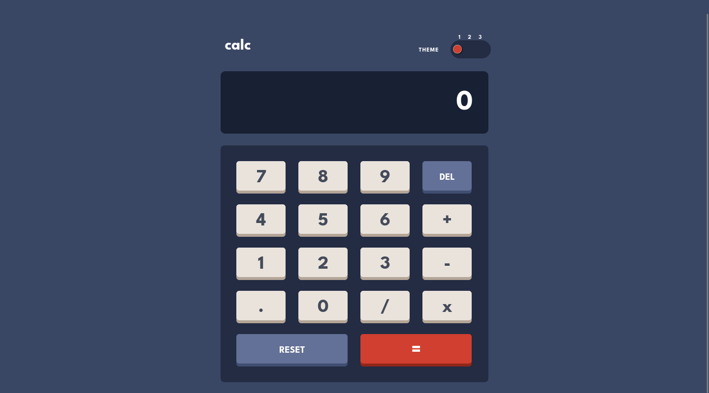

# Frontend Mentor - Calculator app solution :abacus:

This is a solution to the [Calculator app challenge on Frontend Mentor](https://www.frontendmentor.io/challenges/calculator-app-9lteq5N29). Frontend Mentor challenges help you improve your coding skills by building realistic projects. 

## Table of contents

- [Overview](#overview)
  - [The challenge](#the-challenge)
  - [Screenshot](#screenshot)
  - [Links](#links)
- [My process](#my-process)
  - [Built with](#built-with)
  - [What I learned](#what-i-learned)
  - [Continued development](#continued-development)
  - [Useful resources](#useful-resources)
- [Author](#author)
- [Acknowledgments](#acknowledgments)

## Overview

### The challenge

Users should be able to:

- See the size of the elements adjust based on their device's screen size
- Perform mathmatical operations like addition, subtraction, multiplication, and division
- Adjust the color theme based on their preference
- **Bonus**: Have their initial theme preference checked using `prefers-color-scheme` and have any additional changes saved in the browser

### Screenshot



### Links

- Solution URL: [Github Repo](https://github.com/webshuriken/frontend-mentor-my-solutions/calculator-app)
- Live URL: [Summary Component Site](https://webshuriken.github.io/frontend-mentor-my-solutions/calculator-app/)

## My process

### Built with

- Semantic HTML5 markup
- Flexbox and CSS Grid
- Mobile-first workflow
- [SASS](https://sass-lang.com/) - SASS

### What I learned

This calculator app was a great oppotunity to learn SASS mixins. It helped to keep the code DRY.
I liked how you can pass it paramters to provide futher customization for that specific element or group of elements.

```
@mixin range-track-p2($bg: var(--toggle-background))
  border-radius: 1rem
  padding: 5px
  background: $bg
```

I also learned that the logic for a calculator is not as simple as working out a value. You need to keep into account the different ways a user can interact with it! There are a few cases which I have not accounted for and will most likely provided unexpected results.

Not sure what these cases are and will only come up as and when it is used.. If you come across one, please raise an issue or a create a pull request. Thank you :grinning:

### Continued development

Even though my JS game is strong there is always room for improvement and there is still a lot of topics I have not looked into.
My SASS knowledge has improved a lot but a bit more practice so that I can best understand when to use a mixin or a module.

### Useful resources

- [SASS](https://sass-lang.com/guide) - This is a fantastic starting point if you are new to SASS.

## Author

- Website - [Carlos E Alford M](https://carlosealford.com)
- Frontend Mentor - [WebShuriken](https://www.frontendmentor.io/profile/WebShuriken)
- Twitter - [@webshuriken](https://www.twitter.com/webshuriken)

## Acknowledgments

I would like to thanks the people maintaining the MDN docs and the SASS docs. They were really helpful. The examples along side the explanations really help to drive the points home.
Also thank you to the people at frontend mentor for keeping this work going and the new opportunities they have made available.
