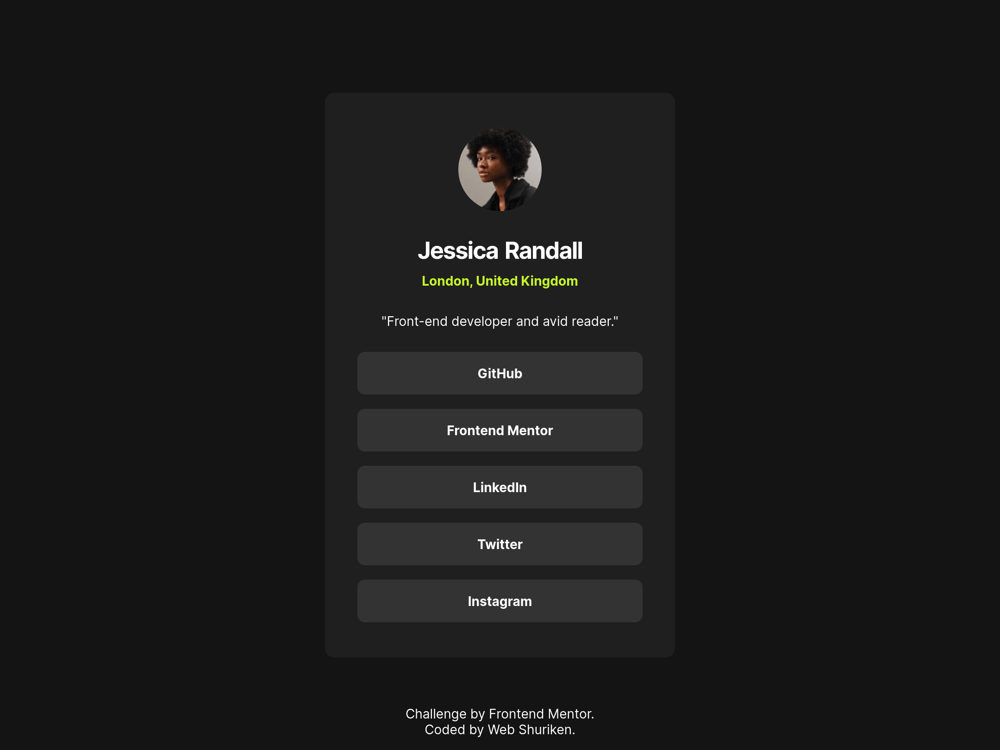

# Frontend Mentor - Social links profile solution

This is a solution to the [Social links profile challenge on Frontend Mentor](https://www.frontendmentor.io/challenges/social-links-profile-UG32l9m6dQ).

## Table of contents

- [Overview](#overview)
  - [The challenge](#the-challenge)
  - [Screenshot](#screenshot)
  - [Links](#links)
- [My process](#my-process)
  - [Built with](#built-with)
  - [What I learned](#what-i-learned)
  - [Continued development](#continued-development)
  - [Useful resources](#useful-resources)
- [Author](#author)
- [Acknowledgments](#acknowledgments)

## Overview

### The challenge

Users should be able to:

- See hover and focus states for all interactive elements on the page
- Add more links keeping the same layout and style

### Screenshot

### Links

- Solution URL: [Solution](https://github.com/webshuriken/frontend-mentor-my-solutions/tree/main/social-links-profile)
- Live Site URL: [Live Site](https://webshuriken.github.io/frontend-mentor-my-solutions/social-links-profile/)

## My process

### Built with

- Mobile-first workflow
- Semantic HTML5 markup
- CSS custom properties
- Flexbox

### What I learned

I want to be able to look at an idea and be able to estimate the time it would take to complete, therefore the project was a way for me to practice my time management skills rather than learning a new techonology.

The importance of planning is taken for granted a lot of the time. It may seem daunting but it will save a lot of time when it is time to develop the app!

It took me a total of **2.2 hours** to setup, create both mobile and large screen versions and write the README with a screenshot. I stimated _1 hour and 20 minutes_. That is a total of 40 minutes more than expected.

### Continued development

I will continue to do this challenges to improve my time management and predictions.

## Author

- Website - [Carlos E Alford](https://www.carlosealford.com)
- Frontend Mentor - [@webshuriken](https://www.frontendmentor.io/profile/webshuriken)
- Twitter - [@webshuriken](https://www.twitter.com/webshuriken)

## Acknowledgments

Thanks to the team behind Frontend Mentor for creating this challenge and all their work.
