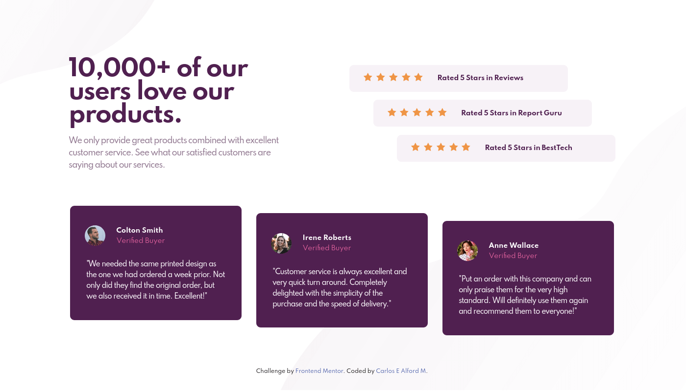

# Frontend Mentor - Social proof section solution

This is a solution to the [Social proof section challenge on Frontend Mentor](https://www.frontendmentor.io/challenges/social-proof-section-6e0qTv_bA). Frontend Mentor challenges help you improve your coding skills by building realistic projects.

## Overview

### The challenge

Users should be able to:

- View the optimal layout for the section depending on their device's screen size

### Screenshot



### Links :link:

- Solution URL: [Github Repo](https://github.com/carlosealford/social-proof-section)
- Live URL: [Social Proof Section Site](https://carlosealford.github.io/social-proof-section/)

## My process

### Built with :wrench:

- Mobile-first workflow
- Semantic HTML5 markup
- CSS with SASS
- Flexbox
- CSS Grid

### What I learned

This project taught me some more about CSS grids. It give you so much flexibility with the layout of your elements. It came in handy when positioning the card and rating boxes.

```sass
.social-proof__reviews-wrapper
  display: grid
  grid-template-columns: 1fr
  grid-template-rows: repeat(3, 1fr)
  row-gap: 1rem
  padding: 2.1rem .2rem
  @media (min-width: 768px)
    grid-template-columns: 1fr 1fr
    grid-template-rows: auto auto
    column-gap: 1rem
```

It also helped me practice CSS background properties and I'm now comfortable using it.

### Continued development :muscle:

Although I feel comfortable with CSS, Semantic HTML5 and SASS there is always room for improvement and SASS can be improved.

### Useful resources :point_down:

- [SASS Basics](https://sass-lang.com/guide) - The guide only showes you the surface but is good for reference while you get used to the concepts.
- [A complete Guide to Grid](https://css-tricks.com/snippets/css/complete-guide-grid/) - Excellent resource for learning and reference. Visual and written examples.

## Acknowledgments :clap:

Credit goes to the documentation and the people involved in writing it. See the **Useful resources** section.

## Author

- Website - [Carlos E Alford M](https://carlosealford.com)
- Frontend Mentor - [WebShuriken](https://www.frontendmentor.io/profile/WebShuriken)
- X (Twitter) - [@webshuriken](https://www.x.com/webshuriken)

## License

[MIT License](../LICENSE)
